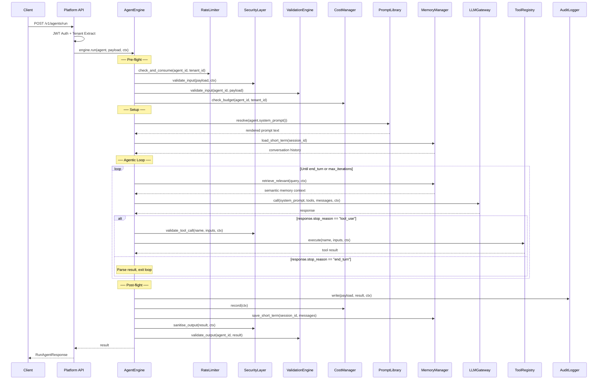
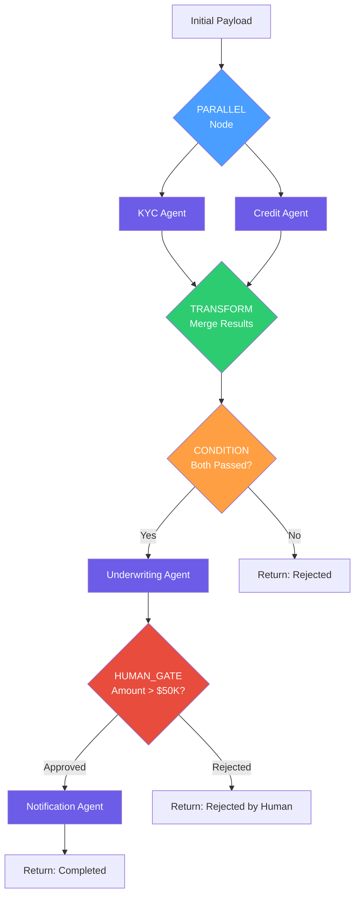
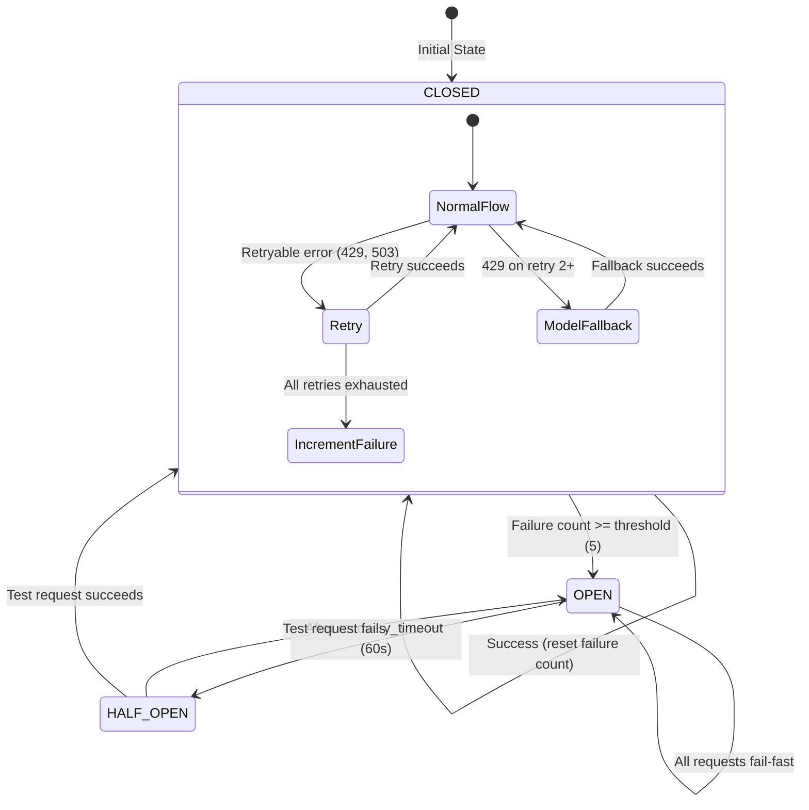
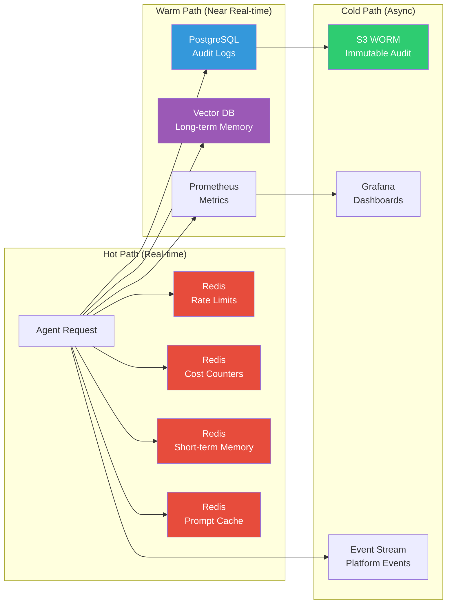
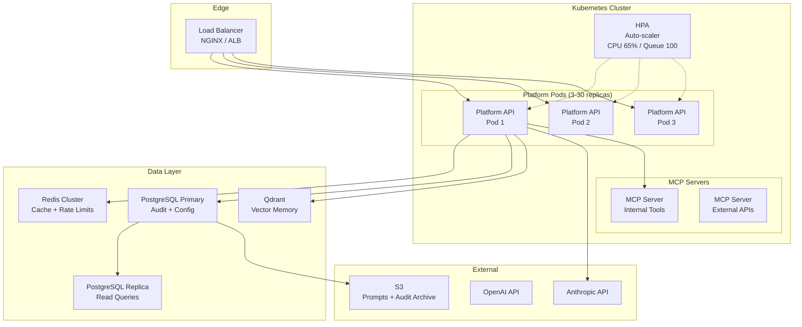
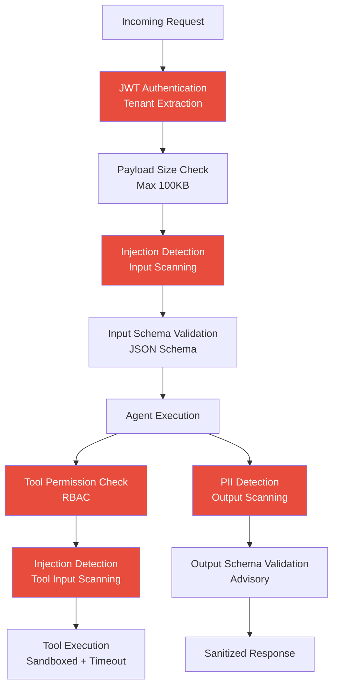
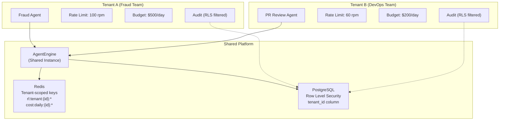
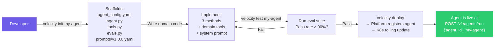

# Velocity Platform — Architecture & Diagrams

## 1. System Architecture (Layered View)

```mermaid
graph TB
    subgraph "LAYER 4: Agent SDK"
        SDK["AgentBase · @tool · AgentBuilder<br/>agent_config.yaml · CLI"]
    end

    subgraph "LAYER 3: Core Engine"
        ENGINE["AgentEngine<br/>Execution Loop"]
        LLM["LLM Gateway<br/>Provider-Agnostic · Retry · Circuit Breaker"]
        TOOLS["Tool Registry<br/>Register · Discover · Execute"]
        PROMPTS["Prompt Library<br/>Version · Cache · A/B Test"]
        MEMORY["Memory Manager<br/>Short · Long · Episodic"]
        ORCH["Orchestration Engine<br/>DAG · Parallel · Human Gate"]
        MCP["MCP Broker<br/>Protocol Translation"]
        EVAL["Eval Framework<br/>Suite · Runner · CI Gate"]
    end

    subgraph "LAYER 2: Platform Services"
        COST["Cost Manager<br/>Budget · Routing · Attribution"]
        RATE["Rate Limiter<br/>Sliding Window · 3-Level"]
        SEC["Security Layer<br/>PII · Injection · RBAC"]
        VAL["Validation Engine<br/>Input · Output · Schema"]
        AUDIT["Audit Logger<br/>Immutable · Dual-Write"]
        EVENTS["Event Bus<br/>Platform Events"]
        METRICS["Observability<br/>Prometheus · Grafana"]
    end

    subgraph "LAYER 1: Infrastructure"
        REDIS["Cache<br/>Redis / In-Memory"]
        PG["Database<br/>Any SQL (config-driven)"]
        VECTOR["Vector Store<br/>Qdrant / pgvector"]
        S3["Object Store<br/>S3 / Local FS"]
        RSTREAM["Event Stream<br/>Redis Streams"]
    end

    SDK --> ENGINE
    ENGINE --> LLM
    ENGINE --> TOOLS
    ENGINE --> PROMPTS
    ENGINE --> MEMORY
    ENGINE --> ORCH
    ENGINE --> MCP
    ENGINE --> EVAL

    ENGINE --> COST
    ENGINE --> RATE
    ENGINE --> SEC
    ENGINE --> VAL
    ENGINE --> AUDIT
    ENGINE --> EVENTS
    ENGINE --> METRICS

    COST --> REDIS
    RATE --> REDIS
    MEMORY --> REDIS
    MEMORY --> VECTOR
    AUDIT --> PG
    AUDIT --> S3
    PROMPTS --> S3
    PROMPTS --> REDIS
    EVENTS --> RSTREAM
    LLM -.->|"Any LLM Provider"| EXTLLM["Anthropic / OpenAI / Google<br/>Azure / Custom (Ollama, vLLM)"]
```

---

## 2. Request Lifecycle (Single Agent Execution)

---

## 3. Multi-Agent Orchestration Flow

---

## 4. LLM Gateway Resilience

---

## 5. Data Flow Architecture

---

## 6. Deployment Topology (Production)

---

## 7. Security Architecture

---

## 8. Multi-Tenancy Isolation Model

**Isolation guarantees:**
- Rate limits: separate Redis keys per tenant — Tenant A exhausting quota does NOT affect Tenant B
- Cost tracking: separate daily/monthly counters per tenant
- Audit logs: PostgreSQL Row Level Security — tenants see only their own records
- Memory: short-term keys scoped to `mem:short:{tenant_id}:{session_id}`

---

## 9. Agent Developer Experience Flow

---

## Technology Stack Summary

| Layer | Component | Dev/Local | Production |
|-------|-----------|-----------|------------|
| Runtime | Python | 3.12+ | 3.12+ (containerized) |
| API Framework | FastAPI | uvicorn (hot-reload) | gunicorn + uvicorn workers |
| Cache | Redis | In-memory dict | Redis Cluster |
| Database | PostgreSQL | SQLite | PostgreSQL 16 + RLS |
| Vector DB | Vector Store | In-memory list | Qdrant / pgvector |
| Object Store | S3 | Local filesystem | S3 + Object Lock |
| Metrics | Prometheus | Console export | Prometheus + Grafana |
| Container | Docker | docker-compose | Kubernetes (EKS/AKS/GKE) |
| LLM Provider | Any (provider-agnostic) | All configured providers | Multi-provider + fallback chains |
| CI/CD | GitHub Actions | Local pytest | lint → type-check → test → eval → deploy |
